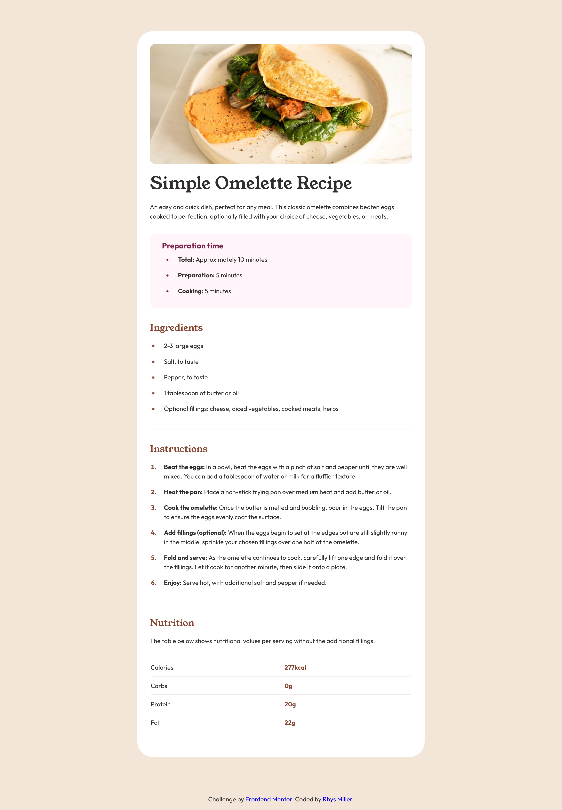

# Frontend Mentor - Recipe page solution

This is a solution to the [Recipe page challenge on Frontend Mentor](https://www.frontendmentor.io/challenges/recipe-page-KiTsR8QQKm). Frontend Mentor challenges help you improve your coding skills by building realistic projects.

## Table of contents

- [Overview](#overview)
  - [The challenge](#the-challenge)
  - [Screenshot](#screenshot)
  - [Links](#links)
  - [Built with](#built-with)
  - [What I learned](#what-i-learned)
  - [Continued development](#continued-development)
  - [Useful resources](#useful-resources)
- [Author](#author)

**Note: Delete this note and update the table of contents based on what sections you keep.**

## Overview

This is my solution to Frontend Mentors Recipe Page Challenge using HTML5 and CSS3.

### Screenshot

### Links

- Solution URL: [Recipe Page Solution](https://your-solution-url.com)
- Live Site URL: [Link](https://stirring-speculoos-28939e.netlify.app)

### Built with

- HTML5
- CSS3

### What I learned

I started with this simple recipe project more to see how Frontend Mentor worked. I was already very proficient in using base web technologies when I took on this project. However it always good to go back an sharpen up the skills every once in a while as I find that I will always solidify a concept or learn something new on every new project no matter the size.

### Continued development

I am going to continue to work through more Frontend Mentor challenges as I often struggle to come up with project ideas and they provide plenty of variety. I intend to work my up to more complex projects alongside learning new frameworks and technologies

### Useful resources

- [W3 Schools](https://www.w3schools.com/) - This helped me refresh my memory using certain HTML and CSS properties such as creating tables and registering font files within my style sheet . I really like this site and am always using it for reference.

## Author

- Website - [rhysmiller.dev](https://rhysmiller.dev/)
- Frontend Mentor - [@rjmills87](https://www.frontendmentor.io/profile/rjmills87)
- Linkedin - [Rhys Miller](https://www.linkedin.com/in/rjmills87/)
